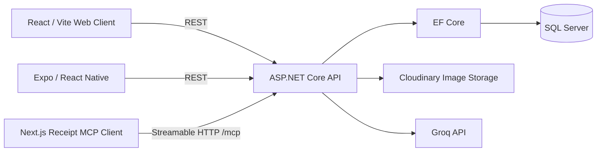

# AI-Powered Receipt Processing System

## Overview

ReceiptAI is a full-stack, cross-platform receipt-processing application. A shared .NET 10 backend supports a React web client, an Expo/React Native mobile app, and MCP-based interaction. Receipt images are stored in Cloudinary, processed by a vision-capable model through Groq, and saved as structured receipt records in SQL Server.

## Architecture

The backend follows a layered architecture:

- **Domain** contains the receipt entity and business rules.
- **Application** contains DTOs, interfaces, and receipt workflows.
- **Infrastructure** implements EF Core persistence, Cloudinary storage, Groq extraction, and MCP capabilities.
- **API** exposes REST controllers and the Streamable HTTP MCP endpoint.



The Next.js MCP client also uses Groq for its conversational assistant and Cloudinary for image upload. It connects to the MCP endpoint hosted by the ASP.NET Core API.

## Key Features

- Upload receipt images from the web or mobile app
- Extract merchant, purchase date, total, currency, and category with AI
- Review extracted values before saving
- Persist, paginate, view, filter, and delete receipts
- Query receipts by category, date, date range, recent activity, or current month
- Access receipt workflows through MCP tools, resources, resource templates, and prompts
- Use a dedicated MCP chat interface with explicit confirmation for mutations

## Technology Stack

### Backend

- .NET 10 and ASP.NET Core Web API
- Layered Domain, Application, Infrastructure, and API projects
- Dependency injection, REST controllers, OpenAPI, and Scalar API reference

### Web Client

- React 19, TypeScript, Vite 8, React Router, Axios
- Tailwind CSS 4 and Framer Motion

### Mobile

- Expo 54, React Native 0.81, TypeScript, and Expo Router
- NativeWind, Expo Image, and Expo Image Picker

### MCP

- Model Context Protocol .NET SDK with Streamable HTTP transport
- Next.js 16 MCP client and receipt assistant
- MCP capability discovery and guarded mutation execution

### Data

- SQL Server
- Entity Framework Core 10 with code-first migrations
- Cloudinary image storage

### AI / Search

- Groq's OpenAI-compatible API
- `qwen/qwen3.6-27b` for receipt image extraction
- `openai/gpt-oss-120b` for the MCP chat assistant
- Repository queries and client-side filters; no embedding or vector-search implementation

## AI Receipt Processing

The web and mobile clients use the same review-first workflow:

```text
Receipt image -> API upload -> Cloudinary URL -> Groq extraction
              -> structured fields -> user review -> API persistence -> display
```

The extraction service sends the hosted image URL and a constrained prompt to Groq. It normalizes the model response into merchant name, purchase date, total amount, ISO currency code, and one supported category before the client reviews and saves the record.

## MCP Integration

The ASP.NET Core API exposes MCP at `/mcp` in Development. The server provides:

- **Tools:** create from an image, create manually, extract, list all, get by ID, paginate, and delete.
- **Resources:** all receipts, receipt by ID, recent receipts, summary, category, date, date range, current month, and paginated views.
- **Prompts:** guided workflows for image creation, receipt lookup, category/date queries, current-month queries, and tool- or resource-based pagination.

`mcp-receipts` is a separate Next.js application that discovers those capabilities and presents them through menus and a Groq-powered chat experience. It is separate from the React and mobile applications because it exercises the MCP protocol rather than the conventional REST API. Mutation tools require explicit UI confirmation.

Authentication is not currently configured. The MCP endpoint is intended for development/local use unless explicitly enabled in another environment. Production deployment would require an appropriate authentication and security layer.

## Web Application

The React/Vite client provides paginated and filtered receipt lists, summary statistics, receipt details, deletion, and an upload flow. Users upload an image, run AI extraction, review or correct the fields, and save the receipt.

## Mobile Application

The Expo app can select an image from the photo library or capture one with the camera. It supports image upload, AI extraction, field review, persistence, paginated receipt browsing, filtering, details, pull-to-refresh, and deletion.

## Data

Receipts are stored in SQL Server through EF Core. The persisted record includes merchant, purchase date, total, currency, category, image URL, Cloudinary public ID, and creation timestamp. Query support is relational and filter-based; PostgreSQL, embeddings, and vector databases are not used.

## Project Structure

```text
ReceiptAI/
├── ReceiptAI.Domain/            # Receipt entity and domain rules
├── ReceiptAI.Application/       # DTOs, interfaces, and application services
├── ReceiptAI.Infrastructure/    # EF Core, SQL Server, Cloudinary, Groq, and MCP
├── ReceiptAI.API/               # REST API and MCP HTTP host
├── ReceiptAI.UnitTests/         # Unit tests
├── ReceiptAI.IntegrationTests/  # API and persistence integration tests
├── client/                      # React/Vite web client
├── receiptai-mobile/            # Expo/React Native mobile app
├── mcp-receipts/                # Next.js MCP client and chat interface
└── ReceiptAI.slnx
```

## Getting Started

### Prerequisites

- .NET 10 SDK
- SQL Server or SQL Server LocalDB
- Node.js and npm
- Expo Go, an Android emulator, or an iOS simulator for mobile development
- Groq and Cloudinary accounts
- EF Core CLI (`dotnet tool install --global dotnet-ef`) if applying migrations

### 1. Configure and run the API

Keep credentials out of source control. Configure these ASP.NET Core environment variables with your own values:

```text
ConnectionStrings__DefaultConnection=Server=(localdb)\mssqllocaldb;Database=ReceiptAIDb;Trusted_Connection=True;MultipleActiveResultSets=true
Cloudinary__CloudName=<cloud-name>
Cloudinary__ApiKey=<api-key>
Cloudinary__ApiSecret=<api-secret>
GroqSettings__ApiKey=<groq-api-key>
GroqSettings__Model=qwen/qwen3.6-27b
GroqSettings__BaseUrl=https://api.groq.com/openai/v1
```

Then restore dependencies, apply the database migrations, and start the API:

```bash
dotnet restore ReceiptAI.slnx
dotnet ef database update --project ReceiptAI.Infrastructure --startup-project ReceiptAI.API
dotnet run --project ReceiptAI.API
```

The launch profiles use `https://localhost:7095` and `http://localhost:5144`. Scalar is available at `/scalar`.

### 2. Run the React/Vite client

Create `client/.env` without committing it:

```text
VITE_API_BASE_URL=https://localhost:7095
```

```bash
cd client
npm install
npm run dev
```

The configured development port is `3000`.

### 3. Run Receipt MCP

Create `mcp-receipts/.env`:

```text
MCP_SERVER_URL=http://localhost:5144/mcp
GROQ_API_KEY=<groq-api-key>
CLOUDINARY_CLOUD_NAME=<cloud-name>
CLOUDINARY_API_KEY=<api-key>
CLOUDINARY_API_SECRET=<api-secret>
```

With the API running in Development, start the Next.js app on a different port from the web client:

```bash
cd mcp-receipts
npm install
npm run dev -- --port 3001
```

### 4. Run Receipt Mobile

Set `API_BASE_URL` in `receiptai-mobile/lib/api.ts` to an API URL reachable from the device or emulator. A physical device cannot use the host machine's `localhost`; use a LAN address or development tunnel.

```bash
cd receiptai-mobile
npm install
npm start
```

Use the Expo terminal options to open Expo Go, Android, iOS, or the web target.

### 5. Run tests

```bash
dotnet test ReceiptAI.slnx
```

## Engineering Practices

- Layered architecture and separation of concerns
- Dependency injection and interface-based external services
- Async/await with cancellation-token propagation
- EF Core repositories and migrations
- REST and MCP interfaces over a shared application/data layer
- Separate web, mobile, and MCP clients
- Unit and integration test projects

## Project Status

ReceiptAI is a portfolio project demonstrating end-to-end integration between .NET, React, React Native, SQL Server, AI-powered document processing, and Model Context Protocol (MCP). It demonstrates how a shared application and data layer can support conventional REST clients alongside MCP-based AI interactions.

## Author

**Antonio Cruz**  
Senior .NET / Full Stack Engineer

GitHub: <https://github.com/tonycruz-dev>
