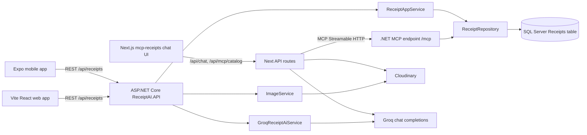
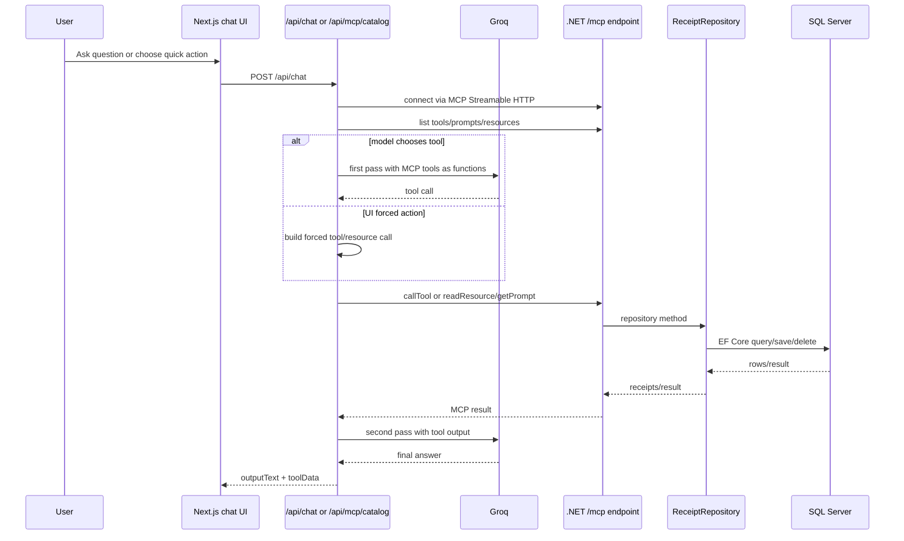
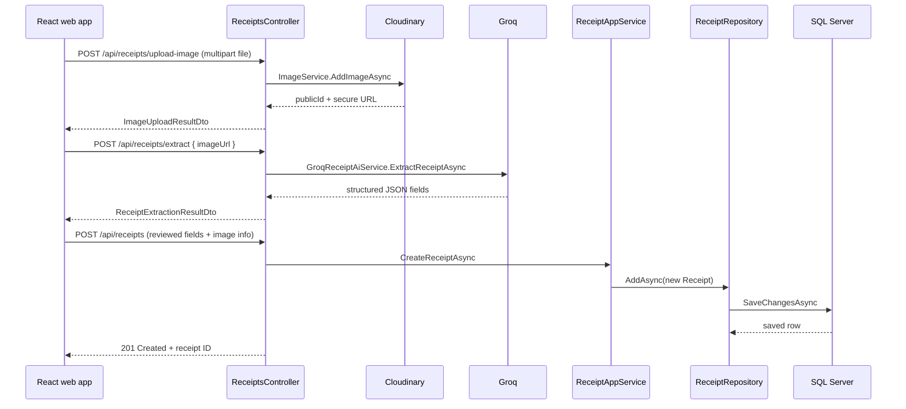
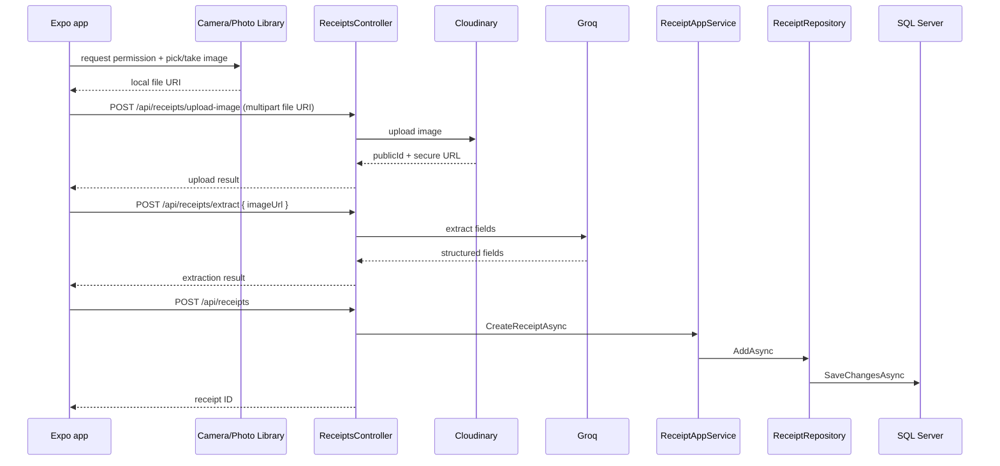

# ReceiptAI Application Architecture Investigation

## 1. Executive Summary

ReceiptAI is a multi-client receipt processing system with a .NET backend, a Vite React web client, an Expo/React Native mobile client, and a separate Next.js MCP/chat client. The backend is the source of truth for receipt persistence and exposes both REST endpoints and an HTTP MCP endpoint over the same application services/repositories.

The implemented architecture is close to Clean Architecture in the .NET solution: `ReceiptAI.API` hosts controllers and MCP, `ReceiptAI.Application` defines DTOs/interfaces/application services, `ReceiptAI.Domain` contains the `Receipt` entity and domain validation, and `ReceiptAI.Infrastructure` implements SQL Server EF Core persistence plus Cloudinary, Groq and MCP capabilities.

The React and mobile apps both access SQL indirectly through the REST API; neither client connects directly to SQL. The Next.js `mcp-receipts` app accesses receipt data through the .NET MCP endpoint, but it also duplicates image upload/deletion via its own Cloudinary API routes.

The most important immediate risks are security-related: committed configuration files contain provider credential keys, REST and MCP mutation endpoints have no confirmed authentication/authorization, uploads lack file type/size validation, and MCP tools can create/delete/read receipts without an auth boundary in inspected code. Do not treat this system as production-secure without fixing those issues.

No RAG/vector/embedding implementation was confirmed. AI usage is direct Groq chat-completions: one .NET service extracts structured fields from receipt images, and the Next.js chat route uses Groq with MCP tools/resources as callable functions.

## 2. Repository Map

Top-level structure:

| Path | Responsibility | Status |
| --- | --- | --- |
| `ReceiptAI.slnx` | .NET solution referencing API, Application, Domain, Infrastructure, UnitTests and IntegrationTests. | Active |
| `ReceiptAI.API/` | ASP.NET Core Web API host, REST controllers, MCP endpoint registration, OpenAPI/Scalar setup, appsettings. Entry point: `Program.cs`. | Active backend |
| `ReceiptAI.Application/` | DTOs, paging models, service interfaces, `ReceiptAppService`. | Active shared backend application layer |
| `ReceiptAI.Domain/` | Domain entity `Receipt` with constructor validation. | Active domain |
| `ReceiptAI.Infrastructure/` | EF Core DbContext/migrations/repository, Cloudinary image service, Groq extraction service, MCP tools/resources/prompts. | Active infrastructure |
| `ReceiptAI.UnitTests/` | xUnit/Moq unit tests for domain, app service, Groq service, MCP tools/resources. | Tests |
| `ReceiptAI.IntegrationTests/` | ASP.NET Core integration tests with SQLite/in-memory DB and fake image/extraction services. | Tests |
| `client/` | Vite React web app. Entry points: `src/main.tsx`, `src/App.tsx`. | Active web client |
| `receiptai-mobile/` | Expo/React Native app using Expo Router. Entry point: `expo-router/entry`; layout in `app/_layout.tsx`. | Active mobile client |
| `mcp-receipts/` | Next.js app that provides MCP catalogue/chat UI and server routes that call the .NET MCP endpoint. Entry point: `app/page.tsx`. | Active MCP/chat client, not the MCP server |
| `.github/`, `.vscode/`, `.vs/` | Tooling/editor metadata. | Support/generated |
| `*.csproj.lscache`, `mcp-receipts/.next/`, `node_modules/`, `bin/`, `obj/` | Build/cache/generated artifacts. | Generated, should not drive architecture conclusions |

Important manifests and entry points:

- `.NET`: `ReceiptAI.slnx`; project files under each `ReceiptAI.*/*.csproj`.
- Web: `client/package.json`, `client/vite.config.ts`, `client/index.html`, `client/src/main.tsx`.
- Mobile: `receiptai-mobile/package.json`, `receiptai-mobile/app.json`, `receiptai-mobile/app/_layout.tsx`.
- Next MCP/chat client: `mcp-receipts/package.json`, `mcp-receipts/next.config.ts`, `mcp-receipts/app/page.tsx`.
- Backend config: `ReceiptAI.API/appsettings.json`, `ReceiptAI.API/appsettings.Development.json`.
- Client config: `client/.env`.
- MCP/chat client config: `mcp-receipts/.env`.

## 3. Technology Stack

Backend:

- ASP.NET Core on `net10.0`, controllers, OpenAPI, Scalar.
- EF Core SQL Server via `UseSqlServer(configuration.GetConnectionString("DefaultConnection"))`.
- ModelContextProtocol ASP.NET Core, HTTP transport, mapped at `/mcp`.
- CloudinaryDotNet for receipt image storage.
- Groq-compatible OpenAI chat completions over HTTP for receipt extraction.

Web:

- React 19, Vite 8, TypeScript, React Router 7, Axios, Framer Motion, Tailwind tooling.
- API base URL from `VITE_API_BASE_URL`.

Mobile:

- Expo 54, React Native 0.81, React 19.1, Expo Router, NativeWind, Expo Image Picker.
- API base URL hard-coded in `receiptai-mobile/lib/api.ts`.

MCP/chat client:

- Next.js 16 App Router, React 19, `@modelcontextprotocol/client`, OpenAI SDK configured for Groq, Cloudinary SDK.
- CopilotKit packages are installed and `McpServerManager.tsx` attempts optional client-side MCP registration, but the main implemented chat path uses Next API routes.

Database:

- SQL Server in production/development configuration.
- SQLite/in-memory providers only in tests.

## 4. Architecture Overview

The REST API and MCP endpoint share the same DI container. REST controllers mostly use `IReceiptAppService`, `IImageService`, and `IReceiptExtractionService`. MCP tools/resources are registered from `ReceiptAI.Infrastructure` and use `IReceiptRepository` plus `IReceiptExtractionService` directly.

Dependency direction in backend code:

- `ReceiptAI.Domain` has no project dependencies.
- `ReceiptAI.Application` references Domain.
- `ReceiptAI.Infrastructure` references Application and Domain.
- `ReceiptAI.API` references Application and Infrastructure.

This is a reasonable Clean Architecture shape. One caveat: MCP tools call repositories directly instead of the application service, so some application-level DTO mapping/business workflow logic is duplicated.

## 5. Web Application

Framework and routing:

- `client/src/main.tsx` renders `<ReceiptsProvider><App /></ReceiptsProvider>`.
- `client/src/App.tsx` uses `BrowserRouter` routes:
  - `/` -> `ReceiptListPage`
  - `/upload` -> `UploadReceiptPage`
  - `/receipts/:id` -> `ReceiptDetailsPage`

State management:

- React Context in `client/src/context/ReceiptsProvider.tsx` and `ReceiptsContext.tsx`.
- State covers receipts, selected receipt, loading/error, pagination and filters.

API client:

- `client/src/api/axios.ts` creates Axios with `baseURL: ${VITE_API_BASE_URL}/api`.
- `client/src/api/receipts.ts` wraps REST endpoints.

Authentication and authorization:

- No confirmed login, auth provider, token storage, Axios interceptor, `Authorization` header or route guard in inspected web code.

Configuration:

- `client/.env` contains `VITE_API_BASE_URL`.
- The same `.env` also contains MCP/Groq/Cloudinary keys that are not used by the Vite receipt client path inspected here and should not be committed.

Important screens and endpoints:

| Screen | Main files | Backend endpoints used |
| --- | --- | --- |
| Receipt list/dashboard | `ReceiptListPage.tsx`, `ReceiptsProvider.tsx`, `ReceiptFilters.tsx` | `GET /api/receipts`, `GET /api/Receipts/recent`, `GET /api/Receipts/category/{category}`, `GET /api/Receipts/date-range`, `GET /api/Receipts/by-date/{date}`, `GET /api/Receipts/this-month`, `GET /api/Receipts/categories` |
| Upload/review/save | `UploadReceiptPage.tsx` | `POST /api/receipts/upload-image`, `POST /api/receipts/extract`, `POST /api/receipts` |
| Receipt details/delete | `ReceiptDetailsPage.tsx` | `GET /api/receipts/{id}`, `DELETE /api/receipts/{id}` |

Observed issue: web types/components refer to `createdAt` in detail display, but `ResponseReceiptDto` returned by the backend does not include `CreatedAt`. This is a confirmed model mismatch risk from `ReceiptDetailsPage.tsx` versus `ResponseReceiptDto`.

## 6. Mobile Application

Framework and platforms:

- Expo/React Native app with Expo Router.
- `app.json` enables iOS tablet support, Android adaptive icons/edge-to-edge, and static web output.
- Supported targets from scripts: Android, iOS, web, Expo development server.

Navigation:

- `receiptai-mobile/app/_layout.tsx` wraps routes in `ReceiptsProvider` and defines stack screens `(tabs)` and `receipts/[id]`.
- `receiptai-mobile/app/(tabs)/_layout.tsx` defines two tabs: receipts list and upload.

State/API:

- `receiptai-mobile/context/ReceiptsProvider.tsx` duplicates the web context pattern.
- `receiptai-mobile/lib/api.ts` uses `fetch` wrappers for the same REST endpoints.
- API base URL is hard-coded to a dev tunnel in code, not environment-driven.

Authentication and local storage:

- No confirmed auth, token handling, `SecureStore`, `AsyncStorage`, or persistent local receipt cache in inspected mobile code.

Functionality parity with web:

- Shared features: list receipts, pagination, filters by recent/category/date/date-range/this-month, categories fetch, upload image, extract fields, create receipt, view details, delete receipt.
- Mobile-specific behavior: `expo-image-picker` supports both media library selection and camera capture.
- Web-specific behavior: browser file input; Framer Motion UI animations.
- Duplicated code: API wrappers, receipt DTO/type definitions, context/provider logic, receipt formatter utilities and upload/review flows are implemented separately in `client/` and `receiptai-mobile/`.

## 7. Backend/API

Host and middleware:

- `ReceiptAI.API/Program.cs` registers controllers, infrastructure, OpenAPI, CORS, MCP, Scalar, HTTPS redirection and authorization.
- CORS policy `AllowFrontend` allows only `http://localhost:3000` and `https://localhost:3000`.
- MCP is mapped at `/mcp` with stateless HTTP transport.

REST controllers:

`ReceiptAI.API/Controllers/ReceiptsController.cs` exposes:

| Method | Route | Purpose | Dependency |
| --- | --- | --- | --- |
| `POST` | `/api/receipts/upload-image` | Upload image to configured image service. | `IImageService` |
| `POST` | `/api/receipts` | Create receipt record. | `IReceiptAppService` |
| `GET` | `/api/receipts` | Paged receipt list. | `IReceiptAppService` |
| `GET` | `/api/receipts/{id}` | Receipt by GUID. | `IReceiptAppService` |
| `POST` | `/api/receipts/extract` | Extract receipt data from image URL. | `IReceiptExtractionService` |
| `DELETE` | `/api/receipts/{id}` | Delete receipt record. | `IReceiptAppService` |
| `GET` | `/api/receipts/recent?count=` | Recent receipts. | `IReceiptAppService` |
| `GET` | `/api/receipts/category/{category}` | Receipts by category. | `IReceiptAppService` |
| `GET` | `/api/receipts/summary` | Aggregate summary. | `IReceiptAppService` |
| `GET` | `/api/receipts/date-range?from=&to=` | Receipts in date range. | `IReceiptAppService` |
| `GET` | `/api/receipts/by-date/{date}` | Receipts for exact date. | `IReceiptAppService` |
| `GET` | `/api/receipts/this-month` | Current month receipts. | `IReceiptAppService` |
| `GET` | `/api/receipts/categories` | Distinct categories. | `IReceiptAppService` |

Application layer:

- `ReceiptAppService` creates/deletes receipts and maps `Receipt` to `ResponseReceiptDto`.
- `IReceiptRepository`, `IReceiptAppService`, `IImageService`, `IReceiptExtractionService` define the main backend ports.

Infrastructure:

- `DependencyInjection.AddInfrastructure` registers EF Core SQL Server except in `Testing`, configures `CloudinarySettings` and `GroqSettings`, adds `HttpClient<GroqReceiptAiService>`, and registers scoped services.
- `ImageService` uploads/deletes images in Cloudinary folder `receipts`.
- `GroqReceiptAiService` validates image URLs and sends a chat-completions request to Groq, expecting strict JSON.

## 8. SQL Database and Data Access

SQL technology:

- SQL Server via EF Core in normal environments.
- Connection string key: `ConnectionStrings:DefaultConnection`.
- Development value points to localdb database `ReceiptAIDb`.

ORM/model:

- `ApplicationDbContext` exposes `DbSet<Receipt> Receipts`.
- `OnModelCreating` configures:
  - `Id` primary key.
  - `MerchantName` max length 200, required.
  - `Currency` max length 10, required.
  - `Category` max length 100, required.
  - `ImageUrl` max length 500.
  - `TotalAmount` decimal(18,2).

Migrations:

- `20260405150929_InitialCreate` creates the `Receipts` table with columns `Id`, `MerchantName`, `PurchaseDate`, `TotalAmount`, `Currency`, `Category`, `ImageUrl`, `CreatedAt`, `ImagePublicId`.
- `20260423155153_EnforceReceiptFieldRequirements` is empty, but its designer/snapshot preserve the model.

Entities and relationships:

- Only one persisted entity was confirmed: `Receipt`.
- No foreign keys or table relationships were confirmed in code.

Data access:

- `ReceiptRepository` provides CRUD/read models and summary queries through EF Core.
- Each `AddAsync`/`DeleteAsync` calls `SaveChangesAsync` directly.
- No explicit transaction boundaries were found; operations are single-aggregate EF operations.

Client SQL access:

- Web and mobile clients access SQL indirectly through the REST API.
- Next MCP/chat client accesses SQL indirectly through the .NET MCP endpoint and repository.
- No direct SQL connection from clients was confirmed.

## 9. MCP Architecture and Tool Catalogue

MCP server implementation:

- .NET MCP server is registered in `ReceiptAI.API/Program.cs` with `AddMcpServer()`, stateless HTTP transport, tools from `McpReceiptTool` assembly, resources from `McpReceiptResources`, prompts from `ReceiptPrompts`, mapped to `/mcp`.
- MCP capabilities live under `ReceiptAI.Infrastructure/Mcp/`.

MCP client implementation:

- `mcp-receipts/app/api/mcp/catalog/route.ts` connects to `MCP_SERVER_URL`, lists tools/resources/prompts/resource templates and returns a UI catalogue.
- `mcp-receipts/app/api/chat/route.ts` connects to the MCP server, maps MCP tools to Groq function tools, optionally forces tool/resource/prompt calls from UI actions, executes MCP calls, then asks Groq to produce a final response.
- `mcp-receipts/lib/server/chat/synthetic-tools.ts` adds synthetic helper functions: `mcp_list_resources`, `mcp_read_resource`, `mcp_read_resource_template`, `mcp_list_prompts`, `mcp_get_prompt`.

MCP tools:

| Name | Purpose | Input | Output | Dependencies | State | Auth/authorization |
| --- | --- | --- | --- | --- | --- | --- |
| `create_receipt_from_image` | Extract fields from image URL and create receipt. | `ExtractReceiptRequest { ImageUrl }` wrapped by MCP schema. | `ResponseReceiptDto`. | `IReceiptExtractionService`, `IReceiptRepository`, Groq, SQL. | Writes SQL. | No control confirmed. |
| `create_receipt` | Create receipt from supplied fields. | `CreateReceiptRequest`. | `ResponseReceiptDto`. | `IReceiptRepository`, SQL. | Writes SQL. | No control confirmed. |
| `get_all_receipts` | Retrieve all receipts. | none. | `List<ResponseReceiptDto>`. | `IReceiptRepository`, SQL. | Reads. | No control confirmed. |
| `get_receipt_by_id` | Retrieve receipt by GUID. | `Guid id`. | `ResponseReceiptDto?`. | `IReceiptRepository`, SQL. | Reads. | No control confirmed. |
| `extract_receipt` | Extract fields from image URL without saving. | `ExtractReceiptRequest`. | `ReceiptExtractionResultDto`. | `IReceiptExtractionService`, Groq. | External AI read/process; no SQL write. | No control confirmed. |
| `delete_receipt` | Delete receipt by ID. | `Guid id`. | success string. | `IReceiptRepository`, SQL. | Deletes SQL record. | No control confirmed. |
| `get_receipts_paged` | Retrieve paged receipts. | `GetReceiptsPagedRequest { PageNumber, PageSize }`. | `PagedResult<ResponseReceiptDto>`. | `IReceiptRepository`, SQL. | Reads. | No control confirmed. |

MCP resources:

| URI/template | Purpose | Output | State |
| --- | --- | --- | --- |
| `receipt://all` | All receipts. | JSON list of `ReceiptViewDto`. | Read |
| `receipt://by-id/{id}` | Receipt by GUID. | JSON `ReceiptViewDto`. | Read |
| `receipt://recent/{count}` | Recent N receipts. | JSON list. | Read |
| `receipt://recent` | Recent 10 receipts. | JSON list. | Read |
| `receipt://category/{category}` | Receipts by category. | JSON list. | Read |
| `receipt://summary` | Total count/amount plus currency/category summaries. | JSON `ReceiptSummaryDto`. | Read |
| `receipt://date/{from}/{to}` | Receipts in inclusive date range. | JSON list. | Read |
| `receipt://date/{date}` | Receipts for exact date. | JSON list. | Read |
| `receipt://this-month` | Current UTC month receipts. | JSON list. | Read |
| `receipt://page/{pageNumber}/{pageSize}` | Paged receipts, page size capped at 100. | JSON `PagedResult<ReceiptViewDto>`. | Read |

MCP prompts:

- `receipts_by_date_range`
- `receipts_paged_tool`
- `receipts_paged_resource`
- `create_receipt_from_image`
- `receipts_this_month`
- `receipts_by_date`
- `receipts_by_category`
- `receipt_by_id`

MCP call flow:

Duplication with REST:

- MCP duplicates most REST receipt read/create/delete capabilities.
- MCP-specific resources/prompts provide AI-friendly retrieval wrappers, but they call the same repository and overlap REST query endpoints.

Unsafe boundaries:

- No MCP authentication/authorization was found in `Program.cs`, tools or resources.
- Destructive `delete_receipt` and create tools are exposed to any connected MCP client if the endpoint is reachable.
- `get_all_receipts` and `receipt://all` can expose all receipt data.
- Input validation is inconsistent: some date/count checks exist in resources, but create tools rely on domain constructor exceptions and URL public-id parsing.
- Tool description for `delete_receipt` says it removes the image from storage, but implementation only deletes the SQL record.

## 10. AI, RAG and Retrieval Assessment

Confirmed AI:

- `GroqReceiptAiService` calls Groq-compatible `/chat/completions` using configured `GroqSettings:Model`, `GroqSettings:ApiKey`, and `GroqSettings:BaseUrl`.
- It sends a system prompt requiring JSON fields: merchantName, purchaseDate, totalAmount, currency, category, rawText.
- `mcp-receipts/app/api/chat/route.ts` uses the OpenAI SDK with `baseURL: https://api.groq.com/openai/v1` and model `openai/gpt-oss-120b`.

Not confirmed:

- No embeddings, vector store, semantic search, RAG pipeline, OCR engine, function-calling in .NET extraction, or direct SQL generation was confirmed.
- `openai` and `@anthropic-ai/sdk` are dependencies in `mcp-receipts/package.json`, but the inspected active chat code uses OpenAI SDK configured to Groq. Anthropic usage was not confirmed.

RAG value assessment:

- Current data is structured receipts in one SQL table with straightforward filters/aggregates. Existing repository queries and MCP resources are enough for exact lookups, summaries, date/category filters and pagination.
- RAG would likely add unnecessary complexity for current capabilities.
- RAG or vector search may become useful later if the app persists full OCR text, line items, natural-language merchant aliases, or large unstructured receipt bodies and needs semantic search over them.

## 11. Authentication and Security

Confirmed:

- `Program.cs` calls `UseAuthorization()` but no `AddAuthentication`, `UseAuthentication`, policy registration, or `[Authorize]` attributes were found.
- Web and mobile clients do not send tokens or authorization headers.
- Next MCP/chat client connects to `MCP_SERVER_URL` without credentials in inspected server code.
- `ReceiptAI.API/appsettings.json`, `client/.env`, and `mcp-receipts/.env` contain sensitive-looking credential keys. Values are intentionally not repeated here.

Security risks:

- Critical: provider secrets appear committed in config/env files.
- Critical: REST and MCP endpoints have no confirmed authentication or authorization.
- High: upload endpoints do not enforce content type, extension, file size, malware scanning, or image validation in inspected code.
- High: MCP mutation tools are externally callable if `/mcp` is reachable.
- High: Groq error handling returns provider response text in `ErrorMessage`, which may leak provider details to clients.
- Medium: CORS only allows localhost 3000, but CORS is not an authentication boundary and does not protect MCP clients or server-to-server requests.
- Medium: image URLs are stored and returned; prompts try to avoid printing them in chat, but REST/MCP resources expose them.

Secrets/config key locations:

- `ReceiptAI.API/appsettings.json`: `Cloudinary:*`, `GroqSettings:*`.
- `ReceiptAI.API/appsettings.Development.json`: `ConnectionStrings:DefaultConnection`.
- `client/.env`: `VITE_API_BASE_URL` plus unrelated MCP/Groq/Cloudinary keys.
- `mcp-receipts/.env`: `MCP_SERVER_URL`, `GROQ_API_KEY`, `CLOUDINARY_*`, `NEXT_PUBLIC_COPILOTKIT_API_KEY`.

## 12. End-to-End Data Flows

React upload-to-database flow:

Mobile upload-to-database flow:

Read/list/delete flows:

- Web/mobile list screens call REST filters. `ReceiptAppService` maps repository `Receipt` entities to `ResponseReceiptDto`.
- Details screens call `GET /api/receipts/{id}`.
- Delete screens call `DELETE /api/receipts/{id}`, which removes the SQL row only; image deletion is not performed in the REST delete path despite `IImageService.DeleteImageAsync` existing.

## 13. Shared and Duplicated Functionality

Shared:

- Web and mobile share the same REST API and backend SQL data model.
- REST and MCP share the same DI container and repository/database.
- Backend DTOs/interfaces are shared across .NET backend layers.

Duplicated:

- Web and mobile duplicate receipt API clients, context state, filters, type definitions and formatter logic.
- REST controller and MCP tools/resources duplicate several query/create/delete paths.
- Next.js `mcp-receipts` duplicates Cloudinary upload/delete routes already present in the .NET API.
- Multiple DTO shapes exist for similar receipt output: `ReceiptDto`, `ResponseReceiptDto`, `ReceiptViewDto`, web/mobile `ReceiptDto` types.

Model inconsistencies:

- `ResponseReceiptDto` lacks `CreatedAt` and `ImagePublicId`, but web/mobile detail screens/types reference `createdAt`.
- `ImageUploadResultDto` in .NET has `Error`, while frontend code checks `errorMessage` in some branches.
- API route casing is inconsistent in clients (`/receipts` and `/Receipts`). ASP.NET Core routing is usually case-insensitive on supported servers, but this is still inconsistent.

## 14. Testing and Observability

Tests:

- Unit tests cover `Receipt` validation, `ReceiptAppService`, `GroqReceiptAiService`, `McpReceiptTool`, and `McpReceiptResources`.
- Integration tests cover major REST controller paths using SQLite/in-memory DB plus fake image/extraction services.

Coverage gaps:

- No confirmed tests for the React web client.
- No confirmed tests for the Expo mobile client.
- No confirmed tests for Next.js MCP/chat routes.
- No confirmed authorization/security tests because auth is not implemented.
- No confirmed tests for file size/type validation.
- MCP integration tests do not appear to exercise the actual `/mcp` HTTP endpoint end-to-end.

Observability:

- ASP.NET Core logging is configured through appsettings log levels.
- No structured logging, correlation IDs, request telemetry, metrics, tracing or health checks were confirmed.
- Next.js chat/catalog routes use `console.error`/`console.log`.

## 15. Risks and Technical Debt

Confirmed defects:

- Committed secrets/credentials in configuration/env files.
- No confirmed auth boundary for REST or MCP.
- `delete_receipt` MCP description says it removes images from storage, but implementation only deletes SQL.
- REST delete path also does not call `IImageService.DeleteImageAsync`.
- Frontend expects fields (`createdAt`, sometimes `errorMessage`) that backend DTOs do not consistently return.
- Mobile API base URL is hard-coded to a dev tunnel.

Architectural risks:

- MCP tools bypass `ReceiptAppService`, causing duplicated business/mapping behavior.
- `get_all_receipts` and `receipt://all` can read unbounded data.
- Summary calculation loads all receipts into memory before grouping.
- `ReceiptRepository` uses `PurchaseDate.Date` in queries, which can reduce index friendliness on SQL Server.
- Empty migration suggests schema intent changed but migration contains no operation.
- Generated/cache files such as `.csproj.lscache` are present in the repo and may create noise.

Optional improvements:

- Share TypeScript client/types between web/mobile, or generate clients from OpenAPI.
- Normalize DTO naming and date formats.
- Move Cloudinary upload for MCP chat through the backend, or clearly separate Next.js as its own backend-for-frontend.
- Add health checks and telemetry.

## 16. Prioritised Recommendations

| Priority | Classification | Recommendation | Evidence |
| --- | --- | --- | --- |
| Critical | Fix now | Remove committed secrets, rotate exposed keys, move secrets to user-secrets/env/secret manager, and add secret scanning. | `ReceiptAI.API/appsettings.json`, `client/.env`, `mcp-receipts/.env` contain credential key names and values. |
| Critical | Fix now | Add authentication and authorization to REST and MCP, especially create/delete/read-all operations. | No `AddAuthentication`, `UseAuthentication` or `[Authorize]` found; MCP exposes mutation tools. |
| High | Fix now | Add upload validation: max request/body size, allowed MIME/extensions, image validation and error handling. | `ReceiptsController.UploadImage` checks only null/length; Next image route checks only file exists/size > 0. |
| High | Fix now | Align delete behavior: either delete Cloudinary images in REST/MCP delete flows or update tool/API descriptions. | `IImageService.DeleteImageAsync` exists; delete flows call only repository delete. |
| High | Fix now | Remove hard-coded dev tunnel URL from mobile and use environment/app config. | `receiptai-mobile/lib/api.ts` constant `API_BASE_URL`. |
| Medium | Improve later | Route MCP mutation tools through `IReceiptAppService` or shared application use cases to reduce duplicated logic. | `McpReceiptTool` uses `IReceiptRepository` directly. |
| Medium | Improve later | Normalize DTOs and client types, including `CreatedAt`, `ImagePublicId`, upload error shape and date formats. | Backend `ResponseReceiptDto` differs from web/mobile expectations. |
| Medium | Improve later | Generate or share REST clients/types from OpenAPI to reduce web/mobile duplication. | Duplicate `api.ts`/`receipts.ts`, contexts and receipt types. |
| Medium | Improve later | Add bounded pagination defaults to all broad reads and consider disabling `get_all_receipts` for external MCP clients. | `get_all_receipts` and `receipt://all` are unbounded. |
| Low | Keep as-is | Keep the current .NET project layering; it is understandable and testable for this application size. | Solution/project dependency direction is clean. |
| Low | Needs further investigation | Decide whether `mcp-receipts` is an internal admin/chat tool or external user-facing surface, then secure/deploy accordingly. | It has its own Next routes, Cloudinary handling and MCP access. |
| Low | Improve later | Add frontend/mobile/Next route tests and observability. | No client tests or structured telemetry confirmed. |

## 17. Unknowns and Questions

- Deployment topology is not confirmed: dev tunnels are configured, but production hosting was not inspected.
- Whether the exposed secrets are active is not confirmed; they should still be treated as compromised.
- Whether `.env` files are intentionally committed or local-only in this copy is not confirmed.
- Whether `mcp-receipts` is intended for internal operators or end users is not confirmed.
- Whether a future line-item model, OCR store, or RAG feature is planned is not confirmed.
- Whether SQL indexes exist outside EF migrations is not confirmed; no live database was queried.

## 18. Evidence Index

Backend:

- `ReceiptAI.slnx` lists all .NET projects.
- `ReceiptAI.API/Program.cs` registers controllers, infrastructure, OpenAPI, CORS, MCP and Scalar.
- `ReceiptAI.API/Controllers/ReceiptsController.cs` defines REST endpoints.
- `ReceiptAI.Infrastructure/DependencyInjection.cs` wires EF Core SQL Server, Cloudinary, Groq and app services.
- `ReceiptAI.Domain/Entities/Receipt.cs` defines the only confirmed domain entity and validation rules.
- `ReceiptAI.Application/Services/ReceiptAppService.cs` implements receipt use cases and DTO mapping.
- `ReceiptAI.Application/Interfaces/*.cs` define repository, app service, image and extraction abstractions.
- `ReceiptAI.Infrastructure/Repositories/ReceiptRepository.cs` implements EF Core queries and persistence.
- `ReceiptAI.Infrastructure/Persistence/ApplicationDbContext.cs` defines EF Core model configuration.
- `ReceiptAI.Infrastructure/Migrations/20260405150929_InitialCreate.cs` creates the `Receipts` table.
- `ReceiptAI.Infrastructure/Integrations/ImageService.cs` implements Cloudinary upload/delete.
- `ReceiptAI.Infrastructure/Integrations/GroqReceiptAiService.cs` implements image URL validation and Groq extraction.

MCP:

- `ReceiptAI.Infrastructure/Mcp/Tools/McpReceiptTool.cs` defines MCP tools.
- `ReceiptAI.Infrastructure/Mcp/Resources/McpReceiptResources.cs` defines MCP resources/templates.
- `ReceiptAI.Infrastructure/Mcp/Prompts/ReceiptPrompts.cs` defines MCP prompts.
- `ReceiptAI.Infrastructure/Mcp/Requests/GetReceiptsPagedRequest.cs` defines MCP paging input.
- `mcp-receipts/app/api/mcp/catalog/route.ts` lists remote MCP capabilities.
- `mcp-receipts/app/api/chat/route.ts` orchestrates Groq and MCP calls.
- `mcp-receipts/lib/server/chat/mcp-client.ts`, `groq-tools.ts`, `synthetic-tools.ts`, `action-router.ts`, `selected-context-router.ts` implement the MCP client/chat support layer.

Web:

- `client/package.json` identifies Vite/React/Axios/React Router dependencies.
- `client/src/main.tsx`, `client/src/App.tsx` define app bootstrap and routes.
- `client/src/api/axios.ts`, `client/src/api/receipts.ts` define REST API access.
- `client/src/context/ReceiptsProvider.tsx`, `ReceiptsContext.tsx` define state management.
- `client/src/pages/*.tsx` define list, upload and detail screens.

Mobile:

- `receiptai-mobile/package.json`, `app.json` identify Expo/React Native platform.
- `receiptai-mobile/app/_layout.tsx`, `app/(tabs)/_layout.tsx` define navigation.
- `receiptai-mobile/lib/api.ts` defines REST API access.
- `receiptai-mobile/context/ReceiptsProvider.tsx`, `ReceiptsContext.tsx` define state management.
- `receiptai-mobile/app/(tabs)/index.tsx`, `upload.tsx`, `app/receipts/[id].tsx` define main screens.

Tests and docs:

- `ReceiptAI.UnitTests/*.cs` cover domain, app service, Groq service and MCP capabilities.
- `ReceiptAI.IntegrationTests/*.cs` cover REST controller paths with test databases/fakes.
- `README.md`, `ReceiptAI.API/README.md`, `client/README.md`, `receiptai-mobile/README.md`, `mcp-receipts/README.md` provide intent/background, but some statements are stale or template-generated and were not treated as stronger evidence than code.
